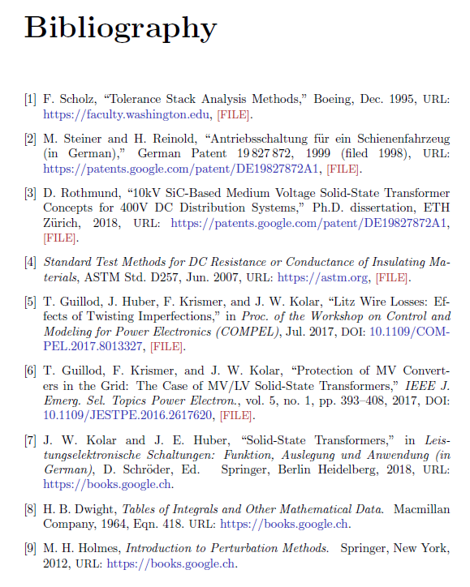

# IEEEtran.bst BibTeX Style with File, DOI, and URL Links

This **modified IEEEtran.bst BibTeX** style (renamed IEEEtran_link.bst) offers some extension:
* Linking a **PDF** file
* Linking an **URL**
* Linking a **DOI** (Digital Object Identifier)

The following commands can be used in the BibTeX file:
```
linkfile={pdf/filename.pdf},
linkurl={https://url.org},
linkdoi={10.1109/JESTPE.2016.2617620},
```

And the resulting PDF file looks like:
<p float="middle">
    
</p>

An example (Latex + BibTeX) is provided in [IEEEtran_link.bst](IEEEtran_link.bst) and [thesis.tex](thesis.tex).
The resulting PDF file can be seen in [thesis.pdf](thesis.pdf).

## Compatibility

* Tested with bibtex (MiKTeX 2.9 and TeX Live 2017)
* Tested with pdflatex (MiKTeX 2.9 and TeX Live 2017)
* Tested with lualatex (MiKTeX 2.9 and TeX Live 2017)

## Bugs

I wrote this file for my PhD thesis. So it was tested with the following entry types:
* misc / pdhthesis / 
* patent / standard
* inproceedings / article
* incollection / inbook / inbook

This file does not pretend to cover all the other entries offered by IEEEtran.bst.
However, it should be easy to extend the file to the remaining entries.

The diff between:
* The original style file ([IEEEtran.bst](IEEEtran.bst))
* The modified style file ([IEEEtran_link.bst](IEEEtran_link.bst))

is quite limited: about 100 lines out of 2500.

## Author

**Thomas Guillod** - [GitHub Profile](https://github.com/otvam)

## License

This project is licensed under the **LaTeX Project Public License**, see [LICENSE.md](LICENSE.md).
